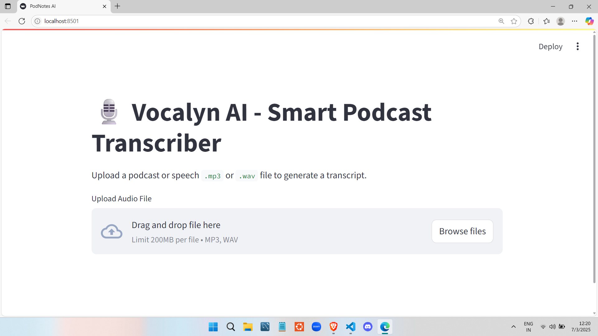
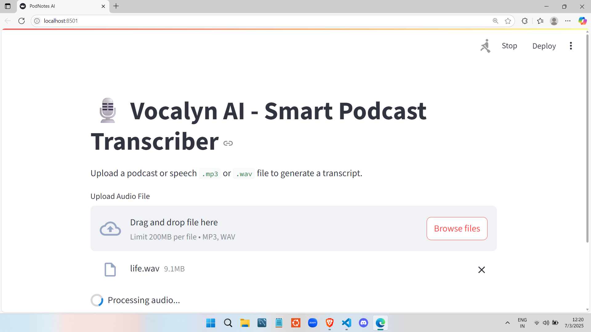
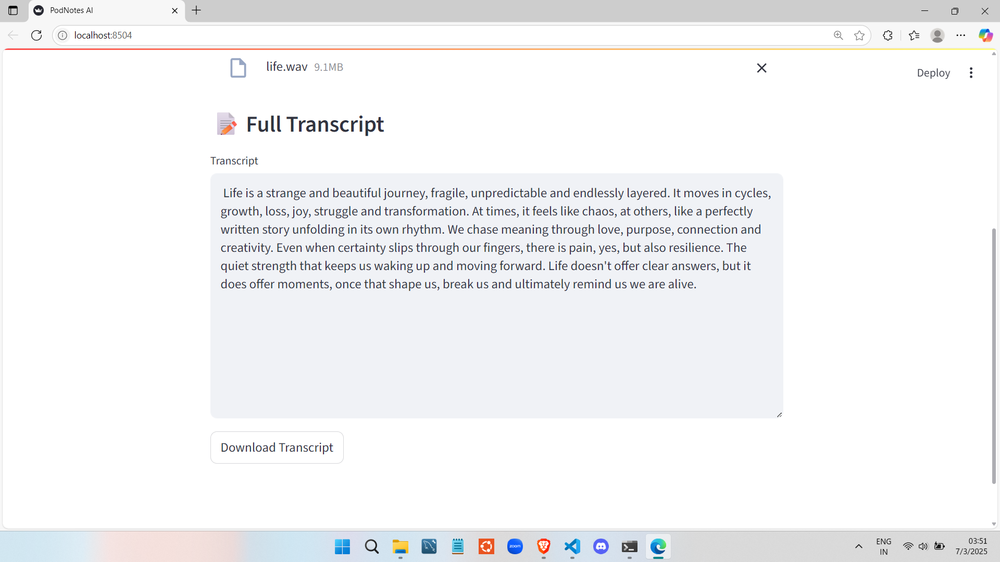

<h1 align="center" style="font-size: 3rem;">Vocalyn – High-Fidelity Audio Transcription</h1>

Vocalyn is a lightweight, GPU-accelerated tool that converts audio files—podcasts, interviews, or voice recordings—into accurate, readable transcripts using OpenAI’s Whisper model. Designed with a minimal Streamlit interface.

---

## Features

- Accurate transcription with Whisper (base model)
- GPU acceleration via CUDA 
- Supports `.mp3` and `.wav` uploads
- Automatic audio format conversion using Pydub
- Clean display of full transcript
- Downloadable `.txt` transcript
- Lightweight, production-ready Streamlit UI

---

## Tech Stack

| Component        | Technology                      |
|------------------|----------------------------------|
| Transcription    | OpenAI Whisper (base)            |
| Interface        | Streamlit                        |
| Audio Processing | Pydub, tempfile                  |
| Language         | Python 3.10+                     |
| Acceleration     | CUDA-enabled GPU                 |

---

## Setup Instructions

### 1. Clone the repository
```bash
git clone https://github.com/kaustubh-k8/vocalyn.git
cd vocalyn 
```

### 2. Install dependancies
pip install -r requirements.txt

### 3. Run the application
streamlit run app.py

### 4. Preview
### App Home Screen


### Upload Section


### Transcript Display



Made By:  
Kaustubh 

- GitHub: @kaustubh-k8
- LinkedIn: kaustubh-kuwar-811b6327b


